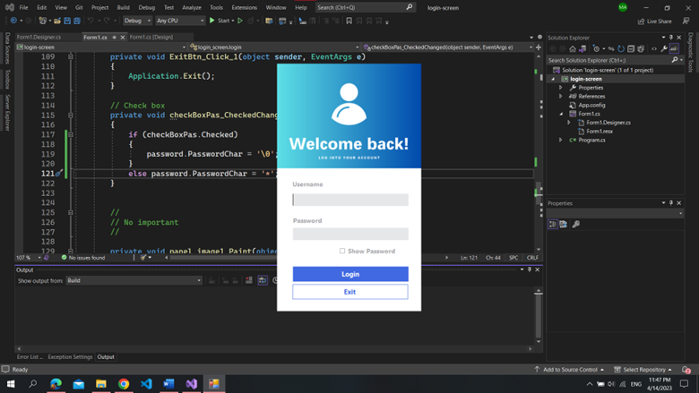
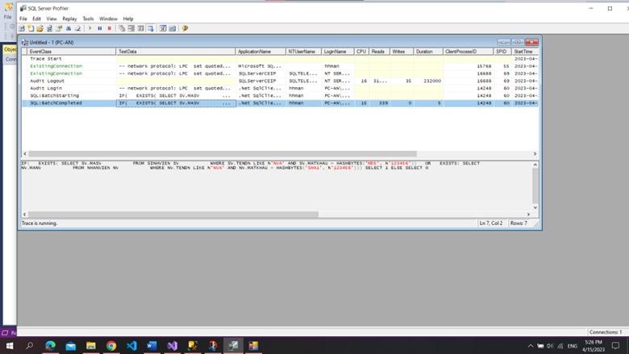

# 🔒 Login Screen Security
Use .NET framework to build screen and apply  encryption on server.

- `SHA-1`, `MD5`: hash password user

😩 weakness is easy to attack

## 🔥 Login screen

## 🤔 ❌ May be Attacked

## 🤓 STORED PROCEDURE

Support encryption data on server

- `SP_INS_ ENCRYPT _SINHVIEN`: insert data and encryption, hash `MD5` password.
- `SP_INS_ ENCRYPT _NHANVIEN `: insert data and encrypt `AES_256`salary.

## 📚 Conclusion
Not safe. Because the administrator can see the data as the client passes to the server

